<div align="center">
  
</div>

---

## 🧑‍💻 About Me

```java
public class Akshat {

    String   university   = "BITS Pilani, Dubai Campus — CS (Year 2)";
    String[] focusAreas   = {"Backend Engineering", "Deep Learning", "System Design"};
    String[] dailyDrivers = {"Java", "Spring Boot", "Python", "PyTorch"};
    String[] building     = {"Scalable APIs", "Distributed Systems", "Neural Networks"};
    String   openTo       = "Internships · Collaborations · Open Source";

    void lifePhilosophy() {
        System.out.println("Ship fast. Learn faster. Scale when it hurts.");
    }
}
```

## 🌐 Socials

<p align="center">
  <a href="https://www.linkedin.com/in/akshat-saxena-457b4b229/" target="_blank"></a>
  <a href="https://github.com/AKSHEXXXX" target="_blank"></a>
  <a href="https://x.com/Akshats___" target="_blank"></a>
  <a href="https://www.instagram.com/akshatttt02/" target="_blank"></a>
  <a href="https://medium.com/@akshatextreme/about" target="_blank"></a>
  <a href="mailto:akshatextreme@gmail.com" target="_blank"></a>
</p>

# 💻 Tech Stack:
                        

# 📊 GitHub Stats:

<br/>

<br/>


### ✍️ Random Dev Quote


---
[](https://visitcount.itsvg.in)

<!-- Proudly created with GPRM ( https://gprm.itsvg.in ) -->
